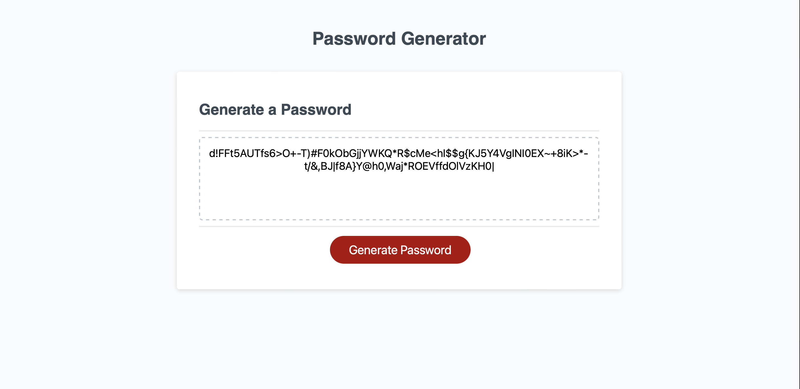

# Random Password Generator

## Description 
In this repository an HTML/JS file which generates a random password when the user inputs the following criteria.
Password generator is intended for public use and at the users discretion. 
>* Uppercase
>* Lowercase
>* Symbols
>* numbers
>* min/max (8 - 128) character length
Once the following requirements have been met via clicking the generate button. 
The password generator can be found on [this page](https://utero93.github.io/PW-R-GEN/)

## Installation
Navigate to the repository,
>* copy ssh key and git clone plus ssh key in terminal
>* in terminal enter "code ." and if programmed already, the text editor of your choice should open with the files from the repo inside.
>* open the HTML page in the text editor and right click on the tab to open in either a "default/live" browser.
>* from there follow the prompts and enjoy creating random passwords.
>* other way to install is by downloading zip files into users desktop or specified folder for downloads.  

## Usage 
Once you have opened the HTML file in the browser
>* click on the generate password button
>* a prompt asking for character length input will appear, enter the amount desired by the user.
>* next a prompt asking to include lowercase letters will appear, the user can choose to include lowercase or not by hitting the "cancel" option
>* the next prompt will ask the user if they want to include uppercase letters, and again the user can choose at their own discretion.
>* the next prompt will ask the user to choose if they want to include special characters, and the user can again, decide to "cancel" or include that in their password.
>* finally, the last ptompt for the user to choose is whether to include numbers or not. They may choose to add it or not.
>* once this portion of prompts is complete, a password using the criteria specified by the user  will generate.
>* depending on what prompts the user chooses to include or not include will affect what password is generated.
>* Password will not generate if the user doesnt enter a character length, or chooses to not include any of the prompts that appear once clicking the generate password button.

## Credits 
N/A

